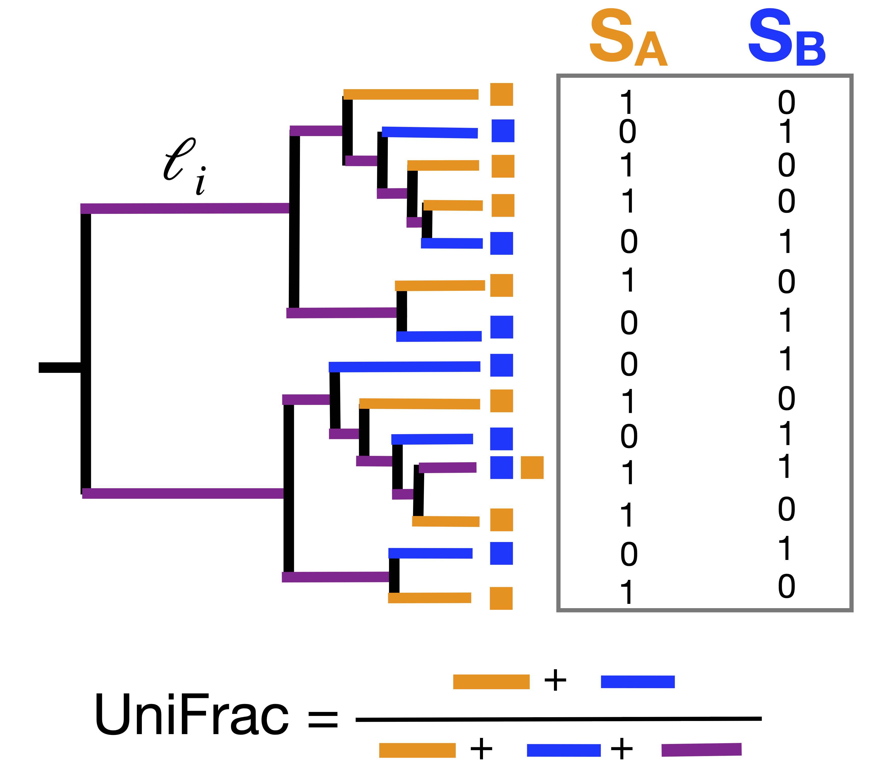
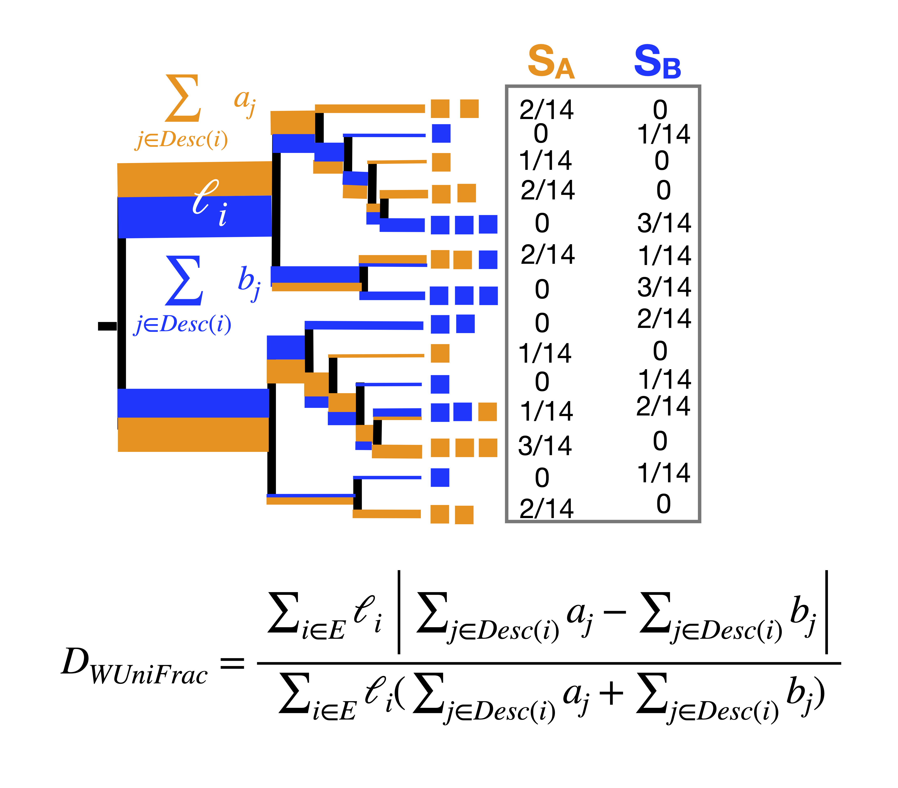

[](http://bioconda.github.io/recipes/dartunifrac/README.html)


[](https://anaconda.org/bioconda/dartunifrac)

<div align="center">
  
</div>


# DartUniFrac: Approximate UniFrac via Weighted MinHash 🦀
This crate provides an efficient implementation of the newly invented ***DartUniFrac*** algorithm for large-scale [UniFrac](https://en.wikipedia.org/wiki/UniFrac) computation (weighted and unweighted). We named this new algorithm DartUniFrac because the key step is to use DartMinHash or Efficient Rejection Sampling (or ERS) on branches and the DartMinHash/ERS is about "Among the first r darts thrown, return those hitting $x_i$". 


## Quick install and usage
On Linux or MacOS (CPU)
```bash
conda install -c bioconda -c conda-forge dartunifrac
```
Linux only (Nvidia GPU)
```bash
conda install -c bioconda -c conda-forge dartunifrac-gpu
```


Run on example data
```bash
wget https://github.com/jianshu93/DartUniFrac/releases/download/v0.2.3/GWMC_16S_otutab.biom
wget https://github.com/jianshu93/DartUniFrac/releases/download/v0.2.3/GWMC_rep_seqs_all.tre
dartunifrac -t ./GWMC_rep_seqs_all.tre -b ./GWMC_16S_otutab.biom -m dmh -s 3072 -o unifrac_unweighted.tsv
dartunifrac -t ./GWMC_rep_seqs_all.tre -b ./GWMC_16S_otutab.biom --weighted -m dmh -s 3072 -o unifrac_weighted.tsv


### obtain the truth via striped unifrac algorithm (SIMD supported), extremely slow at the million-sample scale
striped_unifrac -t ./GWMC_rep_seqs_all.tre -m ./GWMC_16S_otutab.biom --weighted -o unifrac_weighted_striped.tsv

```

GPU on example data:

```bash
dartunifrac-cuda -t ./GWMC_rep_seqs_all.tre -b ./GWMC_16S_otutab.biom -m dmh -s 3072 -o unifrac_unweighted.tsv

dartunifrac-cuda -t ./GWMC_rep_seqs_all.tre -b ./GWMC_16S_otutab.biom --weighted -m dmh -s 3072 -o unifrac_weighted.tsv

```

## Overview

### Unweighted UniFrac
UniFrac (unweighted) can be simply described as unique branches that differ two samples over shared branches (see original UniFrac paper [here](https://journals.asm.org/doi/full/10.1128/aem.71.12.8228-8235.2005)). Here, each sample has some taxa (or features) that are in the phylogenetic tree. 

<div align="center">
  
</div>

If we reformulate UniFrac in math, it can be descriped below:

$$D_{UniFrac}(A,B) = \frac{\displaystyle \sum_{i\in E} \ell_i \cdot |\max_{j\in {Desc}(i)} x_j(A) - \max_{j\in {Desc}(i)} x_j(B)|}{\displaystyle \sum_{i\in E} \ell_i \cdot \max(\max_{j\in {Desc}(i)} x_j(A), \max_{j\in {Desc}(i)} x_j(B) )}$$
$$x_j(S) =
\begin{cases}
      1, & \text{if taxon } j \text{ is present in sample } S,\\
      0, & \text{otherwise.}
    \end{cases}$$
where Desc(i) are all the descendents of branch i. 
since:
$$\displaystyle \sum_{i\in E} \ell_i \cdot |\max_{j\in {Desc}(i)} x_j(A) - \max_{j\in {Desc}(i)} x_j(B)| = \displaystyle \sum_{i\in E} \ell_i \cdot \max(\max_{j\in {Desc}(i)} x_j(A), \max_{j\in {Desc}(i)} x_j(B)) - \displaystyle \sum_{i\in E} \ell_i \cdot \min(\max_{j\in {Desc}(i)} x_j(A), \max_{j\in {Desc}(i)} x_j(B)) $$

Therefore:

$$D_{UniFrac}(A,B)=1-\frac{\displaystyle \sum_{i\in E} \ell_i \cdot \min(\max_{j\in {Desc}(i)} x_j(A), \max_{j\in {Desc}(i)} x_j(B))}{\displaystyle \sum_{i\in E} \ell_i \cdot \max(\max_{j\in {Desc}(i)} x_j(A), \max_{j\in {Desc}(i)} x_j(B) )}$$

since $\displaystyle \ell_i$ can be moved inside max and min (same for sample A and B) and $\max_{j\in {Desc}(i)} x_j(A)$ and $\max_{j\in {Desc}(i)} x_j(B)$ are either 1 or 0. Therefore, it can be rewritten as:
$$D_{UniFrac}(x,y)=1-J_w(x,y) = 1- \frac{\sum_{i=1}^n \min(x_i, y_i)}{\sum_{i=1}^n \max(x_i, y_i)}$$

here, $\displaystyle J_w(x,y)$ is ***Weighted Jaccard Similarity***, which can be efficiently estimated via Weighted MinHash, a sketching algorithm that is widely used for large-scale text mining. We chose [DartMinHash](https://arxiv.org/abs/2005.11547) and [Efficient Rejection Sampling](https://ojs.aaai.org/index.php/AAAI/article/view/16543) due to their speed for sparse and dense data, respectively. In practice, large-scale studies are always sparse, so DartMinHash will be more appropriate because it is both fast and more accurate in this case. However, for cases where there are so many samples but not sparse (e.g., synthetic communities), ERS should be used. See "Choosing L for Efficent Rejection Sampling (ERS)" section for details.

In summary, unweighted UniFrac distance can be considered as weighted Jaccard distance on branches. A fast PCoA on the resulting DartUniFrac distance can also be computed. We rely on fixed rank subspace iteration style randomized SVD, see below. 

### Weighted Unifrac
<div align="center">
  
</div>

Weighted UniFrac measuers the mass accumulate (taxa weight) over branches(see [here](https://journals.asm.org/doi/full/10.1128/aem.01996-06)). Here, Weighted UniFrac is the normalized weighted UniFrac. A similar idea can be used to derive that Weighted UniFrac is a simple transformation from weighted Jaccard
$$D_{WUnifrac}=\frac{1-J_w}{1+J_w}$$

where $J_w$ is:

$$J_w(x,y)=\frac{\sum_{i=1}^n \min(x_i, y_i)}{\sum_{i=1}^n \max(x_i, y_i)}$$

$x_i$ and $y_i$ here represent the product of branch lengh and accumulated mass from taxa weight of 2 samples:

$$x_i=\ell_i*\sum_{j \in Desc(i)} a_j$$


## Libraries
We first created a few libraries for the best performance of DartUniFrac implementation. 

1.Optimal representation of balanced parenthesis for phylogenetic trees via [succparen](https://github.com/sile/succparen)

2.Implementation of DartMinHash and Efficient Rejection Sampling algorithms can be found [here](https://github.com/jianshu93/dartminhash-rs).

3.SIMD-aware Hamming similarity for computing hash collision probability of sketches, [anndists](https://github.com/jianshu93/anndists)

4.A fast, in-memory Principle Coordinate Analysis (PCoA) based on randomized SVD (subspace iteration type SVD), [fpcoa](https://github.com/jianshu93/fpcoa)

## Install
### Pre-compiled on Linux (x86-64)
```bash
wget https://github.com/jianshu93/DartUniFrac/releases/download/v0.2.3/dartunifrac_Linux_x86-64_v0.2.3.zip
unzip dartunifrac_Linux_x86-64_v0.2.3.zip
chmod a+x ./dartunifrac
./dartunifrac -h
```

### macOS via Homebrew: 
```bash
## install homebrew first: https://brew.sh
brew tap jianshu93/DartUniFrac
brew install DartUniFrac
dartunifrac -h
```

### from source
CMake needs to be installed first, see guidance [here](cmake_install.md)
```bash
git clone https://github.com/jianshu93/DartUniFrac.git
cd DartUniFrac
#### You must have CMake installed to compile HDF5 from source. This is for BIOM format input. You also need zstd installed and library files in system path for compression.
### Linux
cargo build --release --features intel-mkl-static,stdsimd
### macos
cargo build --release --features macos-accelerate,stdsimd
```

## Usage
DartUniFrac will use all availble CPU cores/threads via Rayon by default.
```bash
$ ./target/release/dartunifrac -h


 ************** initializing logger *****************

DartUniFrac: Approximate unweighted UniFrac via Weighted MinHash 🎯🎯🎯

Usage: dartunifrac [OPTIONS] --tree <tree> <--input <input>|--biom <biom>>

Options:
  -t, --tree <tree>           Input tree in Newick format
  -i, --input <input>         OTU/Feature table in TSV format
  -b, --biom <biom>           OTU/Feature table in BIOM (HDF5) format
  -o, --output <output>       Output distance matrix in TSV format [default: unifrac.tsv]
      --weighted              Weighted UniFrac (normalized)
  -s, --sketch <sketch-size>  Sketch size for Weighted MinHash (DartMinHash or ERS) [default: 2048]
  -m, --method <method>       Sketching method: dmh (DartMinHash) or ers (Efficient Rejection Sampling) [default: dmh] [possible values: dmh, ers]
  -l, --length <seq-length>   Per-hash independent random sequence length for ERS, must be >= 1024 [default: 4096]
  -T, --threads <threads>     Number of threads, default all logical cores
      --seed <seed>           Random seed for reproducibility [default: 1337]
      --compress              Compress output with zstd, .zst suffix will be added to the output file name
      --pcoa                  Fast Principle Coordinate Analysis based on Randomized SVD (subspace iteration), output saved to pcoa.txt/ordination.txt
      --streaming             Streaming the distance matrix while computing (zstd-compressed)
      --block <block>         Number of rows per chunk, streaming mode only
  -h, --help                  Print help
  -V, --version               Print version
```


```bash
### DartMinHash, biom format input, unweighted
dartunifrac -t ./ASVs_aligned.tre -b ./ASVs_counts.biom -m dmh -s 2048 -o unifrac_dmh_dist.csv

### DartMinHash, biom format input, weighted
dartunifrac -t ./ASVs_aligned.tre -b ./ASVs_counts.biom --weighted -m dmh -s 2048 -o unifrac_dmh_dist.csv

### tsv/txt tabular input
dartunifrac -t ./data/ASVs_aligned.tre -i ./data/ASVs_counts.txt -m dmh -s 2048 -o unifrac_dmh_dist.csv

### Efficient Rejection Sampling
dartunifrac -t ./data/ASVs_aligned.tre -b ./data/ASVs_counts.biom -m ers -s 2048 -l 4096 -o unifrac_ers_dist.csv

### dartMinHash with pcoa and compressed output distance matrix
dartunifrac -t ./data/ASVs_aligned.tre -b ./data/ASVs_counts.biom -m dmh -s 2048 -o unifrac_dmh_dist.tsv --pcoa --compress

### Streaming mode (reduce memory requirement) for large number of samples. Block size is normally 1/50 to 1/5 of sample size
dartunifrac -t ./data/ASVs_aligned.tre -b ./data/ASVs_counts.biom -m dmh -s 2048 -o unifrac_dmh_dist.tsv --streaming --block 8192

```

## GPU support (DartUniFrac-GPU branch, Linux only)
First, you need to install Rust here:
```bash
### Install rust first, see here: https://rustup.rs, after install rustup, run:
rustup install nightly
rustup default nightly

```

### CUDA Toolkit
We provide Nvidia GPU support via CUDA Toolkit (CUDA v12.9.1 or later must be installed and in system library path, see how to install [here](https://developer.nvidia.com/cuda-downloads?target_os=Linux&target_arch=x86_64)) on Linux (x86-64 tested). It will fall back to CPU if no GPU device is detected. Only the Hamming distance computation step benefits from GPU. It is optimized for Nvidia A100 but also works for RTX series. You need to compile from source. 
```bash
git clone --branch DartUniFrac-GPU https://github.com/jianshu93/DartUniFrac.git
cd DartUniFrac
cargo build --release --features intel-mkl-static,stdsimd,cuda
./target/release/dartunifrac-cuda -h

```
### Use Nvidia HPC SDK (recommended)
You can also use bioconda to manage dependencies and compile from source (recommended). See how to install bioconda [here](https://www.anaconda.com/docs/getting-started/miniconda/install)

On Linux:
```
conda create --strict-channel-priority -n dartunifrac -c conda-forge -c bioconda gxx_linux-64 gfortran_linux-64 hdf5 cmake lz4 zlib hdf5-static make curl
conda activate dartunifrac
git clone --branch DartUniFrac-GPU https://github.com/jianshu93/DartUniFrac.git
cd DartUniFrac

```
For NVIDIA-GPU-enabled code, you will need the [NVIDIA HPC SDK](https://developer.nvidia.com/hpc-sdk) compiler, and is only supported on Linux.
The NVIDIA GPU compilation requires the setting of the `NV_CXX` environment variable.

This helper script will download it, install it and setup the necessary environment:
```bash
#### This may take a while, be patient!
./install_hpc_sdk.sh 
source setup_nv_compiler.sh
```
Compile:
```bash
cargo build --release --features intel-mkl-static,stdsimd,cuda
./target/release/dartunifrac-cuda -h
```

Then, let's get some data:

```bash
wget https://github.com/jianshu93/DartUniFrac/releases/download/v0.2.7/ag_emp.tre

wget https://github.com/jianshu93/DartUniFrac/releases/download/v0.2.7/ag_emp_even500.biom

```

You can run GPU in 2 modes:

1. in memory mode:
```bash
RUST_LOG=info dartunifrac-cuda -t ./ag_emp.tre -b ./ag_emp_even500.biom --weighted -m dmh -s 2048 -o ag_emp_even500_weighted_dist.tsv --compress
```

2. streaming mode:
```bash
RUST_LOG=info dartunifrac-cuda -t ./ag_emp.tre -b ./ag_emp_even500.biom --weighted -m dmh -s 2048 -o ag_emp_even500_weighted_dist.tsv --compress --gpu-streaming
```

Speed benchmark for 50k samples, 4 Nvidia RTX 6000 Pro were available
```bash


$ RUST_LOG=info dartunifrac-cuda -t ./ag_emp.tre -b ag_emp_even500.biom --weighted -m dmh -s 2048

 ************** initializing logger *****************

[2025-12-01T07:03:48Z INFO  dartunifrac_cuda] Logger initialized from default environment
[2025-12-01T07:03:48Z INFO  dartunifrac_cuda] 48 threads will be used 
[2025-12-01T07:03:48Z INFO  dartunifrac_cuda] method=dmh   k=2048   seed=1337
[2025-12-01T07:03:48Z INFO  dartunifrac_cuda] Weighted mode
[2025-12-01T07:03:52Z INFO  dartunifrac_cuda] nodes = 614110  leaves = 307055
[2025-12-01T07:03:53Z INFO  dartunifrac_cuda] transposing BIOM CSR→CSC …
[2025-12-01T07:03:53Z INFO  dartunifrac_cuda] building per-sample weighted sets from BIOM (CSC) …
[2025-12-01T07:03:54Z INFO  dartunifrac_cuda] built weighted sets in 288 ms
[2025-12-01T07:03:55Z INFO  dartunifrac_cuda] active edges = 545049 (from 614110 total, 307055 leaves)
[2025-12-01T07:03:55Z INFO  dartunifrac_cuda] sketching starting...
[2025-12-01T07:03:56Z INFO  dartunifrac_cuda] sketching done.
[2025-12-01T07:03:57Z INFO  dartunifrac_cuda] CUDA detected (4 devices). Computing pairwise distances on GPUs …
[2025-12-01T07:04:02Z INFO  dartunifrac_cuda] pairwise distances (GPU) in 4574 ms
[2025-12-01T07:04:02Z INFO  dartunifrac_cuda] Writing uncompressed output → unifrac.tsv
[2025-12-01T07:05:08Z INFO  dartunifrac_cuda] Done → unifrac.tsv

```


2 Nividia A100
```bash
$ RUST_LOG=info dartunifrac-cuda -t ./ag_emp.tre -b ./ag_emp_even500.biom --weighted -m dmh -s 3072 -o ag_emp.weighted.dmh.cuda.tsv --compress --pcoa

 ************** initializing logger *****************

[2025-09-07T05:33:22Z INFO  dartunifrac] Logger initialized from default environment
[2025-09-07T05:33:22Z INFO  dartunifrac] 8 threads will be used 
[2025-09-07T05:33:22Z INFO  dartunifrac] method=dmh   k=3072   seed=1337
[2025-09-07T05:33:22Z INFO  dartunifrac] Weighted mode
[2025-09-07T05:33:26Z INFO  dartunifrac] nodes = 614110  leaves = 307055
[2025-09-07T05:33:27Z INFO  dartunifrac] transposing BIOM CSR→CSC …
[2025-09-07T05:33:27Z INFO  dartunifrac] building per-sample weighted sets from BIOM (CSC) …
[2025-09-07T05:33:28Z INFO  dartunifrac] built weighted sets in 936 ms
[2025-09-07T05:33:28Z INFO  dartunifrac] active edges = 545049 (from 614110 total, 307055 leaves)
[2025-09-07T05:33:28Z INFO  dartunifrac] sketching starting...
[2025-09-07T05:33:43Z INFO  dartunifrac] sketching done.
[2025-09-07T05:33:43Z INFO  dartunifrac] CUDA detected (2 devices). Computing pairwise distances on GPUs …
[2025-09-07T05:34:03Z INFO  dartunifrac] pairwise distances (GPU) in 19668 ms
[2025-09-07T05:34:03Z INFO  dartunifrac] Writing compressed (zstd) output → ag_emp.weighted.dmh.cuda.tsv.zst
```


## Output
1.A distance matrix (see also benchmark section) and pcoa stype output.
Distance matrix:

|    | Orwoll_BI0023_BI | Orwoll_BI0056_BI | Orwoll_BI0131_BI | Orwoll_BI0153_BI | Orwoll_BI0215_BI | Orwoll_BI0353_BI |
|:--|---:|---:|---:|---:|---:|---:|
| Orwoll_BI0023_BI | 0.0 | 0.40307617187 | 0.36596679687 | 0.36010742187 | 0.35815429687 | 0.530273437 |
| Orwoll_BI0056_BI | 0.40307617187 | 0.0 | 0.3901367187 | 0.40747070312 | 0.3398437 | 0.5209960937 |
| Orwoll_BI0131_BI | 0.36596679687 | 0.3901367187 | 0.0 | 0.41577148437 | 0.40014648437 | 0.56860351562 |
| Orwoll_BI0153_BI | 0.36010742187 | 0.40747070312 | 0.41577148437 | 0.0 | 0.260742187 | 0.422851562 |
| Orwoll_BI0215_BI | 0.35815429687 | 0.3398437 | 0.40014648437 | 0.260742187 | 0.0 | 0.45825195312 |
| Orwoll_BI0353_BI | 0.530273437 | 0.5209960937 | 0.56860351562 | 0.422851562 | 0.45825195312 | 0.0 |


2.pcoa.txt (simple):
|  | PC1 | PC2 | PC3 | PC4 | PC5 | PC6 |
|:--|---:|---:|---:|---:|---:|---:|
| Orwoll_BI0023_BI | -0.12912805176115577 | -0.13478145930844512 | 0.042380530554922635 | 0.17338355657990664 | -0.003431287906286917 | 0.0 |
| Orwoll_BI0056_BI | -0.09201950670064461 | 0.23750165032060416 | -0.030767869352507412 | 0.05365540164234924 | -0.04135676583746806 | 0.0 |
| Orwoll_BI0131_BI | -0.18672940644255911 | -0.01880872256563759 | 0.15163198033883335 | -0.1408718693633402 | 0.013611393370684486 | 0.0 |
| Orwoll_BI0153_BI | 0.06843838458354137 | -0.09791766405635079 | -0.12381078744019998 | -0.07508375468747691 | -0.10416130668711489 | 0.0 |
| Orwoll_BI0215_BI | -0.003937706919220717 | -0.00814970660379848 | -0.15251179756497754 | -0.028692966865033972 | 0.11819355132475588 | 0.0 |
| Orwoll_BI0353_BI | 0.3433762872400387 | 0.022155902213627746 | 0.11307794346392891 | 0.017609632693595324 | 0.017144415735429568 | 0.0 |


|  | PC1 | PC2 | PC3 | PC4 | PC5 | PC6 |
|:--|---:|---:|---:|---:|---:|---:|
| proportion_explained | 0.4233339721296298 | 0.19721082825095754 | 0.17875499078496368 | 0.13806192702856432 | 0.0626382818058847 | 0.0 |

3.ordination.txt (scikit-bio/qiime format):
```bash
Eigvals 6
0.18261610725439215     0.0850720143777559      0.07711060939718065     0.059556599124712034    0.027020650223156684    0.0

Proportion explained    6
0.42333397212962964     0.19721082825095754     0.17875499078496382     0.13806192702856435     0.06263828180588471     0.0

Species 0       0

Site    6       6
Orwoll_BI0023_BI        -0.12912805176115583    -0.1347814593084449     0.04238053055492221     0.1733835565799069      -0.0034312879062869286  0.0
Orwoll_BI0056_BI        -0.09201950670064456    0.23750165032060455     -0.030767869352506142   0.05365540164234891     -0.0413567658374681     0.0
Orwoll_BI0131_BI        -0.18672940644255914    -0.018808722565638855   0.15163198033883318     -0.14087186936334042    0.013611393370684503    0.0
Orwoll_BI0153_BI        0.06843838458354136     -0.0979176640563503     -0.1238107874402007     -0.07508375468747673    -0.104161306687115      0.0
Orwoll_BI0215_BI        -0.003937706919220702   -0.008149706603797708   -0.15251179756497782    -0.028692966865033843   0.11819355132475592     0.0
Orwoll_BI0353_BI        0.3433762872400386      0.02215590221362715     0.11307794346392917     0.017609632693595185    0.017144415735429578    0.0

Biplot  0       0

Site constraints        0       0

```

the ordination.txt file can be imported into qiime2 like this:


```bash
qiime tools import --input-path ordination.txt --type 'PCoAResults' --output-path pcoa.qza

```
You can then visulize it via qiime emperor plot. 

## Benchmark
We use Striped UniFrac algorithm as the ground truth, which is an exact and efficient algorithm for large number of samples. A pure Rust implementaion, as a supporting crate for this one, can be found [here](https://github.com/jianshu93/unifrac_bp), also included as a binary in this crate.
### Unweighted
For the testing data (ASVs_count.tsv and ASV_aligned.tre), the truth from Striped UniFrac (unweighted) is:

|    | Orwoll_BI0023_BI | Orwoll_BI0056_BI | Orwoll_BI0131_BI | Orwoll_BI0153_BI | Orwoll_BI0215_BI | Orwoll_BI0353_BI |
|---|---:|---:|---:|---:|---:|---:|
| Orwoll_BI0023_BI | 0 | 0.403847873210907 | 0.3646169304847717 | 0.366204708814621 | 0.3484474122524261 | 0.5317433476448059 |
| Orwoll_BI0056_BI | 0.403847873210907 | 0 | 0.3883068859577179 | 0.4069649279117584 | 0.3338068425655365 | 0.5172212719917297 |
| Orwoll_BI0131_BI | 0.3646169304847717 | 0.3883068859577179 | 0 | 0.4222687482833862 | 0.4006152451038361 | 0.5693299174308777 |
| Orwoll_BI0153_BI | 0.366204708814621 | 0.4069649279117584 | 0.4222687482833862 | 0 | 0.2608364820480347 | 0.4297698140144348 |
| Orwoll_BI0215_BI | 0.3484474122524261 | 0.3338068425655365 | 0.4006152451038361 | 0.2608364820480347 | 0 | 0.4572696685791016 |
| Orwoll_BI0353_BI | 0.5317433476448059 | 0.5172212719917297 | 0.5693299174308777 | 0.4297698140144348 | 0.4572696685791016 | 0 |

DartUniFrac estimation (DartMinHash, unweighted) is: 

|    | Orwoll_BI0023_BI | Orwoll_BI0056_BI | Orwoll_BI0131_BI | Orwoll_BI0153_BI | Orwoll_BI0215_BI | Orwoll_BI0353_BI |
|:--|---:|---:|---:|---:|---:|---:|
| Orwoll_BI0023_BI | 0.0 | 0.40307617187 | 0.36596679687 | 0.36010742187 | 0.35815429687 | 0.530273437 |
| Orwoll_BI0056_BI | 0.40307617187 | 0.0 | 0.3901367187 | 0.40747070312 | 0.3398437 | 0.5209960937 |
| Orwoll_BI0131_BI | 0.36596679687 | 0.3901367187 | 0.0 | 0.41577148437 | 0.40014648437 | 0.56860351562 |
| Orwoll_BI0153_BI | 0.36010742187 | 0.40747070312 | 0.41577148437 | 0.0 | 0.260742187 | 0.422851562 |
| Orwoll_BI0215_BI | 0.35815429687 | 0.3398437 | 0.40014648437 | 0.260742187 | 0.0 | 0.45825195312 |
| Orwoll_BI0353_BI | 0.530273437 | 0.5209960937 | 0.56860351562 | 0.422851562 | 0.45825195312 | 0.0 |

DartUniFrac estimation (Efficient Rejection Sampling, uniweghted) is: 
|    | Orwoll_BI0023_BI | Orwoll_BI0056_BI | Orwoll_BI0131_BI | Orwoll_BI0153_BI | Orwoll_BI0215_BI | Orwoll_BI0353_BI |
|:--|---:|---:|---:|---:|---:|---:|
| Orwoll_BI0023_BI | 0.0 | 0.4101562 | 0.3657226562 | 0.3618164062 | 0.3569335937 | 0.52539062 |
| Orwoll_BI0056_BI | 0.4101562 | 0.0 | 0.40039062 | 0.4086914062 | 0.340820312 | 0.5190429687 |
| Orwoll_BI0131_BI | 0.3657226562 | 0.40039062 | 0.0 | 0.4360351562 | 0.4145507812 | 0.570312 |
| Orwoll_BI0153_BI | 0.3618164062 | 0.4086914062 | 0.4360351562 | 0.0 | 0.264648437 | 0.4311523437 |
| Orwoll_BI0215_BI | 0.3569335937 | 0.340820312 | 0.4145507812 | 0.264648437 | 0.0 | 0.460937 |
| Orwoll_BI0353_BI | 0.52539062 | 0.5190429687 | 0.570312 | 0.4311523437 | 0.460937 | 0.0 |

### Weighted
For the testing data (ASVs_count.tsv and ASV_aligned.tre), the truth from Striped UniFrac (weighted_normalized) is:

|    | Orwoll_BI0023_BI | Orwoll_BI0056_BI | Orwoll_BI0131_BI | Orwoll_BI0153_BI | Orwoll_BI0215_BI | Orwoll_BI0353_BI |
|---|---:|---:|---:|---:|---:|---:|
| Orwoll_BI0023_BI | 0 | 0.3701851367950439 | 0.3719282746315002 | 0.2419339865446091 | 0.235030472278595 | 0.2684231698513031 |
| Orwoll_BI0056_BI | 0.3701851367950439 | 0 | 0.4768573343753815 | 0.3429801762104034 | 0.2965413630008698 | 0.3132076263427734 |
| Orwoll_BI0131_BI | 0.3719282746315002 | 0.4768573343753815 | 0 | 0.3818131387233734 | 0.3768087327480316 | 0.4305019080638885 |
| Orwoll_BI0153_BI | 0.2419339865446091 | 0.3429801762104034 | 0.3818131387233734 | 0 | 0.1378696262836456 | 0.1329282969236374 |
| Orwoll_BI0215_BI | 0.235030472278595 | 0.2965413630008698 | 0.3768087327480316 | 0.1378696262836456 | 0 | 0.139195516705513 |
| Orwoll_BI0353_BI | 0.2684231698513031 | 0.3132076263427734 | 0.4305019080638885 | 0.1329282969236374 | 0.139195516705513 | 0 |

DartUniFrac estimation (DartMinHash, weighted) is: 

|    | Orwoll_BI0023_BI | Orwoll_BI0056_BI | Orwoll_BI0131_BI | Orwoll_BI0153_BI | Orwoll_BI0215_BI | Orwoll_BI0353_BI |
|---|---:|---:|---:|---:|---:|---:|
| Orwoll_BI0023_BI | 0 | 0.3726541554959786 | 0.3562913907284768 | 0.2412121212121212 | 0.24878048780487805 | 0.26889714993804215 |
| Orwoll_BI0056_BI | 0.3726541554959786 | 0 | 0.4566145092460882 | 0.33159947984395316 | 0.2832080200501253 | 0.30612244897959184 |
| Orwoll_BI0131_BI | 0.3562913907284768 | 0.4566145092460882 | 0 | 0.38565629228687415 | 0.3781965006729475 | 0.4301675977653631 |
| Orwoll_BI0153_BI | 0.2412121212121212 | 0.33159947984395316 | 0.38565629228687415 | 0 | 0.1265126512651265 | 0.1277533039647577 |
| Orwoll_BI0215_BI | 0.24878048780487805 | 0.2832080200501253 | 0.3781965006729475 | 0.1265126512651265 | 0 | 0.13399778516057587 |
| Orwoll_BI0353_BI | 0.26889714993804215 | 0.30612244897959184 | 0.4301675977653631 | 0.1277533039647577 | 0.13399778516057587 | 0 |


DartUniFrac estimation (ERS, weighted) is: 
|    | Orwoll_BI0023_BI | Orwoll_BI0056_BI | Orwoll_BI0131_BI | Orwoll_BI0153_BI | Orwoll_BI0215_BI | Orwoll_BI0353_BI |
|---|---:|---:|---:|---:|---:|---:|
| Orwoll_BI0023_BI | 0.0 | 0.37403555853740356 | 0.3540495867768595 | 0.24612108305445696 | 0.2322503008423586 | 0.26929036256585065 |
| Orwoll_BI0056_BI | 0.37403555853740356 | 0.0 | 0.46810035842293907 | 0.3671562082777036 | 0.31324142353318374 | 0.3333333333333333 |
| Orwoll_BI0131_BI | 0.3540495867768595 | 0.46810035842293907 | 0.0 | 0.38331644714623436 | 0.3735747820254863 | 0.4301675977653631 |
| Orwoll_BI0153_BI | 0.24612108305445696 | 0.3671562082777036 | 0.38331644714623436 | 0.0 | 0.14381457693381736 | 0.1265126512651265 |
| Orwoll_BI0215_BI | 0.2322503008423586 | 0.31324142353318374 | 0.3735747820254863 | 0.14381457693381736 | 0.0 | 0.13936022253129346 |
| Orwoll_BI0353_BI | 0.26929036256585065 | 0.3333333333333333 | 0.4301675977653631 | 0.1265126512651265 | 0.13936022253129346 | 0.0 |

## Choosing L for Efficent Rejection Sampling (ERS)
The best L for achiving a given accuracy is related to the sparsity of the data (see ERS paper [here](https://ojs.aaai.org/index.php/AAAI/article/view/16543)). The author recommended an equation for L: $l=\frac{\alpha}{s}$, where s is the sparsity of the data while $\alpha$ is a constant, normally 0.5 to 5. If you have a large dataset, you can randomly choose several samples to check the sparsity (relevant branches). You can obtain $\alpha$ using the Striped UniFrac binary: 

```bash
RUST_LOG=info ./target/release/striped_unifrac -t ./data/ASVs_aligned.tre -i ./data/AS
Vs_counts.txt -o ASVs_striped_unifac_dist.tsv
```
You will see some log like this:
```bash
 ************** initializing logger *****************

[2025-08-21T20:12:38Z INFO  striped_unifrac] logger initialized from default environment
[2025-08-21T20:12:38Z INFO  striped_unifrac] Total branches with positive length: 923
[2025-08-21T20:12:38Z INFO  striped_unifrac] Start parsing input.
[2025-08-21T20:12:38Z INFO  striped_unifrac] phase-1 masks built      0 ms
[2025-08-21T20:12:38Z INFO  striped_unifrac] sample 0: relevant branches = 689 / 923
[2025-08-21T20:12:38Z INFO  striped_unifrac] sample 1: relevant branches = 594 / 923
[2025-08-21T20:12:38Z INFO  striped_unifrac] sample 2: relevant branches = 646 / 923
[2025-08-21T20:12:38Z INFO  striped_unifrac] sample 3: relevant branches = 584 / 923
[2025-08-21T20:12:38Z INFO  striped_unifrac] sample 4: relevant branches = 647 / 923
[2025-08-21T20:12:38Z INFO  striped_unifrac] sample 5: relevant branches = 468 / 923
[2025-08-21T20:12:38Z INFO  striped_unifrac] phase-2 sparse lists built (1 strips)
[2025-08-21T20:12:38Z INFO  striped_unifrac] phase-3 block pass      0 ms
[2025-08-21T20:12:38Z INFO  striped_unifrac] Start writing output.

```
This is a dense example where $\alpha$ is almost 75% so L can be small. For real-world large-scale datasets, $\alpha$ can be as small as 0.001, so a default L=4096 should cover average sparsity around 0.001. In practice, ERS should not be used for very sparse data because as L increases, it is signigicantly slower than DartMinHash. 


## Acknowledgements
We want to thank [Tobias Christiani](https://www.linkedin.com/in/tobias-christiani/), [Otmar Ertl](https://www.linkedin.com/in/otmar-ertl/?originalSubdomain=at) and [Xiaoyun Li](https://lixiaoyun0239.github.io/cv/) for their helpful comments on DartMinHash and Efficient Rejection Sampling. We want to thank Yuhan(Sherlyn) Weng for helping with DartUniFrac logo design.

## References

Paper to come